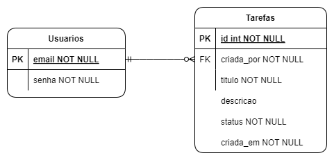

# Gerenciador de Tarefas

## Pré-requisitos

- Docker
- Java 11 e Maven (caso deseje rodar os testes localmente)

## Executando a aplicação

A imagem da aplicação está conteineirizada e hospedada no DockerHub para facilitar a execução local.

Assim, para rodá-la, basta executar o seguinte comando no terminal:

```bash
docker run -p 8080:8080 -t rp35/gerenciador-tarefas
```

Esse comando executará a aplicação no modo *attach*. Dessa forma, será possível observar os logs da diretamente no
terminal o qual executou a imagem.

## Como testar a aplicação

Para facilitar os testes, foram criados dois usuários diferentes e disponbilizada uma coleção do Postman com exemplos de
requisições.

Não foi desenvolvido o gerenciamento de usuários porque o escopo da aplicação não previa essa funcionalidade.

Nesse sentido, foram disponibilizados dois usuários que são cadastrados automaticamente ao subir a aplicação para fins
de teste.

- Usuário 1
    - E-mail: `usuario001@email.com.br`
    - Senha: `usuario001`
- Usuário 2
    - E-mail: `usuario002@email.com`
    - Senha: `usuario002`

Você pode utilizar a coleção do Postman disponível em `docs/gerenciador-tarefas.postman_collection.json` para testar as
funcionalidades.

Nessa coleção, estão todos os *end-points* disponíveis e exemplos de requisições para cada um deles. Alternativamente,
você pode acessar a documentação da API em `/swagger-ui/index.html`.

É importante ressaltar que para acessar os *end-points* é necessário fornecer um *token* de autenticação (Bearer Token).
Para obtê-lo, basta fazer uma requisição do tipo Basic Authentication `/auth/login` com o e-mail e senha de um dos
usuários informados acima.

## Banco e modelo de dados

Por conveniência, foi utilizado um banco de dados em memória (H2). O modelo de dados é simples e composto por duas
entidades: `Usuario` e `Tarefa`.

A entidade tarefa recebe uma chave estrangeira da entidade usuário. Um usuário pode ter 1 ou n tarefas. Uma tarera
pertence a um único usuário. A imagem a seguir ilustra o modelo entidade-relacionamento utilizado.

[](docs/modelo-relacional-dados.png)

## *End-points*

Os *end-points* foram desenvolvidos respeitando os preceitos REST.

A documentação completa poderá ser encontrada em `/swagger-ui/index.html`.

Em resumo, para satisfazer os requisitos funcionais, foram desenvolvidos os seguintes *end-points*.

| path                              | descrição                                                                      | status          |
|-----------------------------------|--------------------------------------------------------------------------------|-----------------|
| POST `/auth/login`                | Autentica usuário e gera um *token* para seu acesso                            | 200 ou 401      |
| POST `/v1/tarefas`                | Cria uma tarefa                                                                | 201 ou 400      |
| GET `/v1/tarefas?status={status}` | Pagina todas as tarefas. Opcionalmente, pode-se filtrar pelo status da tarefas | 200             |
| GET `/v1/tarefas/{id}`            | Busca uma tarefa por id                                                        | 200 ou 404      |
| PUT `/v1/tarefas/{id}`            | Atualiza uma tarefa                                                            | 200, 403 ou 404 |
| PATCH `/v1/tarefas/{id}/status`   | Altera o status de uma tarefa                                                  | 200 ou 404      |
| DELETE `/v1/tarefas/{id}`         | Deleta uma tarefa                                                              | 204, 403 ou 404 |

### Códigos de resposta

Houve preocupação em retornar códigos de resposta adequados, de maneira que eles possam ser interpretados facilmente
pelo solicitante. Abaixo estão os códigos e seus respectivos significados.

- 200: Requisição bem sucedida
- 201: Tarefa criada
- 204: Tarefa deletada (não há corpo)
- 400: Requisição inválida (erro genérico)
- 401: Não autorizado
- 403: Proibido (o solicitante não tem permissão para modificar a tarefa)
- 404: Tarefa não encontrada

### Manipulação de erros

Todos os erros são interceptados e tratados. A aplicação responde com uma mensagem adequadamente formatada e amigável ao
usuário. Além disso, o erro capturado é *logado* para a análise.

É extremamente importante capturar e tratar os erros adequadamente para que as informações internas da aplicação não
sejam expostas a um usuário possivelmente mal-intencionado.

As mensagens de erro seguem o seguinte formato.

```json
{
  "message": "mensagem de erro amigável ao solicitante"
}
```

### *Swagger*

O *Swagger* foi utilizado para documentar a API. A documentação pode ser acessada em `/swagger-ui/index.html`.

## Testes automatizados

Os testes foram desenvolvidos de maneira a expor os requisitos funcionais da aplicação. Eles têm o propósito não só de
identificar possíveis falhas no código, mas de também manter uma documentação viva dele. Dessa meneira, novos
desenvolvedores poderão compreender as funcionalidades e seus comportamentos esperados mais facilmente ao rodar a
bateria de testes.

Para rodar os testes, basta executar o seguinte comando no terminal:

```bash
mvn test
```

Em resumo, estes foram os testes desenvolvidos a fim de proteger a aplicação de possíveis regressões e expor suas
funcionalidades.

| Descrição do teste                                                  |
|---------------------------------------------------------------------|
| Deve paginar todas as tarefas quando o filtro não é informado       |
| Deve filtrar e paginas todas as tarefas quando o filtro é informado | 
| Deve alterar o status da tarefa quando ela existe                   |
| Não deve alterar o status da tarefa quando ela não existe           |
| Deve atualizar tarefa quando o solicitante é seu dono               |
| Não deve atualizar tarefa quando o solicitante não é seu dono       |
| Não deve atualizar tarefa quando ela não existe                     |
| Deve deletar tarefa quando o solicitante é seu dono                 |
| Não deve deletar tarefa quando o solicitante não é seu dono         |

## Segurança

Foi utilizado Spring Security 5 para proteger a aplicação.

A autenticação é feita inicialmente por meio da Basic Authentication.

Após autenticado, é emitido um *token* JWT que deve ser enviado em todas as requisições subsequentes.

Os *tokens* JWT ajudam na escalabilidade da aplicação porque não é necessário manter o estado do usuário no servidor ou
buscar a sessão do usuário a cada requisição.

É também imperioso mencionar que as senhas dos usuários são *haseadas* antes de serem armazenadas no banco de dados.

## *Caching*

Para fins de escabilidade, foi utilizado o Spring Cache para armazenar em memória as tarefas já acessadas. O *cache*
evita a necessidade de acessar o banco de dados a cada requisição, o que pode ser custoso em termos de desempenho.

## *Logging*

Toda requisição HTTP é interceptada e logada. Na interceptação é capturado o usuário solicitante para que todas as ações
possam ser associadas a ele. Além disso, quando a requisição é concluida, é logado o *path* e o *status code* da
resposta. Isso permite que a aplicação possa ser monitorada, exibindo, por exemplo, a taxa de erro para identificar
possíveis problemas.

## Sugesões de melhorias

- Implementar uma infraestrutura com um proxy reverso (Nginx, por exemplo) para fazer o papel de *rate limiter* e *load
  balancer*. O *rate limiting* mitiga ataques de força bruta e o *load balacing* permite que a aplicação seja escalada
  horizontalmente.
- Atualizar para as versões estáveis do Spring e do Java já que a utilização de pacotes desatualizados pode expor a
  aplicação a vulnerabilidades conhecidas.
